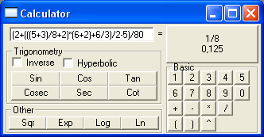



## Evaluate Expression \(More powerful than a calculator\)

### Description

Evaluate an expresion like Evaluate("5+6*2")

returns fractions as well.

Evaluation is a reccursive function that breaks the equation in small little pieces.
 
### More Info
 

             |
---                |---
**Submitted On**   |2005-07-05 16:20:02
**By**             |[Lefteris Eleftheriades](https://github.com/Planet-Source-Code/PSCIndex/blob/master/ByAuthor/lefteris-eleftheriades.md)
**Level**          |Advanced
**User Rating**    |4.7 (33 globes from 7 users)
**Compatibility**  |VB 5\.0, VB 6\.0
**Category**       |[Math/ Dates](https://github.com/Planet-Source-Code/PSCIndex/blob/master/ByCategory/math-dates__1-37.md)
**World**          |[Visual Basic](https://github.com/Planet-Source-Code/PSCIndex/blob/master/ByWorld/visual-basic.md)
**Archive File**   |[Evaluate\_E190944752005\.zip](https://github.com/Planet-Source-Code/lefteris-eleftheriades-evaluate-expression-more-powerful-than-a-calculator__1-61497/archive/master.zip)

